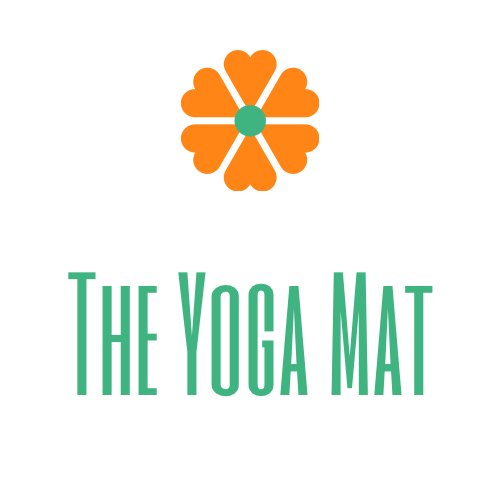

# The Yoga Mat

A website for people who love yoga, those who are experienced and new to the world of yoga.
The website acts as a platform to bring together those interested to take part in yoga related activities, as well as networking and socialsiing.
The website includes information of locations and times where activities organised by 'The Yoga Mat' take place.
The website targets people ages 18 or above.
                               
                    [The Yoga Mat](https://maurasj.github.io/maura-yogis-mat-project/)

## UX

### The goal for this website:
* To organise yoga activities 
* To keep people informed about yoga events around the country
* To inform about the benefits of practicing yoga
* To bring intersted parties together in regards to yoga

### User Stories
1. As a user of this website the desire is to get in contact with other yoga enthusiats and meet up.
2. As a user the goal would be to find appropriate locations to practice yoga.
3. As a user the aim is to expand the community im already a part of.
4. As a fitness enthusiast, I want to start doing Yoga, and meet people who are already experienced.
5. As a begginer I want to meet new people in the yoga community and share tips and experiences.

### Wireframes
Mock ups of the project can be found on these links:
[1.wireframe](assets/images/wireframe-1.png)
[2.wireframe](assets/images/wireframe-2.png)

## Features
From top to bottom, all pages consist of a **navigation bar** with **logo** placed on the left hand side of it. They also have
the same **background image** and **footer**. The **Footer** contains links to the social media pages- that in the future would be 
linked to the Yoga mat.

#### Home
In addition to the above statemnt, the **Home** page consists of a header and a unique photo in a circular container.
#### Yogis
This page is where the information resides, it tells the user where the yoga sessions take place weakly.
It features pictures that resemble the specific said locations, such as park, studio and online.
#### Contact
The contact page, is to connect users to the organisers, for questions in regards to location, exercise, or even to
propose new ideas. 
Contains a form control style, where the user would input their email address, name and a written message,
and with that it also contains a **submit** button.
#### About
This page contains a brief description for the user, and for any new visitors, about the purpose of it.

## Technologhies used
* This project uses technologies such as CSS and HTML.
* GitHub
* Git
* BootsrapCDN- to facilitate the design.
* Google Fonts- to provide a range of fonts.
* jquery
* Canvas app, for the design of the logo.

## Testing
[Testing.md](testing.md)
* The website is readable on both big and small devices, on big screens like computers, the writing is visible as well as the pictures.
On small devices everything is also very clear, the one issue it contains when switching from small to bigger screens and vice versa
are the photos. the photo placed on the circular container changes sizes when on a smaller screen however, at a cost of the whole image itself.
* The **Contact Us** page is straight forward, and it works well.

## Deployment
This project was created on Github, and commited to Git
In order to deploy the website
To deploy this to Github pages from its GitHub repository, these are the instructions:
1. Login to GitHub.
2. Select file **maura-yogis-mat-project**
3. Select Settings from the menu
4. Scroll down to find the **GitHub** pages
5. On the options for **Branch** choose **master**
6. Click the **save** button 
7. The webpage refreshes itself
8. Scroll down again to find **GitHub** pages and copy link shown

### To run this project localy:
The follwoing instructions will allow the project to be cloned onto Gitpod
1. open the Chrome browser
2. Create a GitHub account
3.
4.
5. 
6. 

## Media
* The Media is inspired by locations exercises of Yoga can take place.

## Credits 

### Code
* A huge part of the CSS and HTML codes for the navigation bar were taken, from  
a video on youtube by Drew Ryan (https://www.youtube.com/watch?v=TJF4ldO91n4)

### Media 
* The **photos** used on this project, were my own.

### Acknowledgements
I recieved inspiration for this project from my friend who loves to practice yoga on a weekly basis.
* My mentor Anthony Ngene provied guidance on the design, and help with some coding, specifically in the footer,
and making the pages more resposnive.
* The code-institute slack team.

* Code institute- for the Love Running project- which inspired the photo made circular on the Home page. 
* A big thank you to Jim Morel from Code Institute, who answered a few questions related to coding- 
specifically on making the circular picture more responsive.

### Contributors
*

/*-----license and copyright*/

### Problems
There is a problem with the circular picture, in order to make it responsive ,the viewer is unable to see the full picture.

