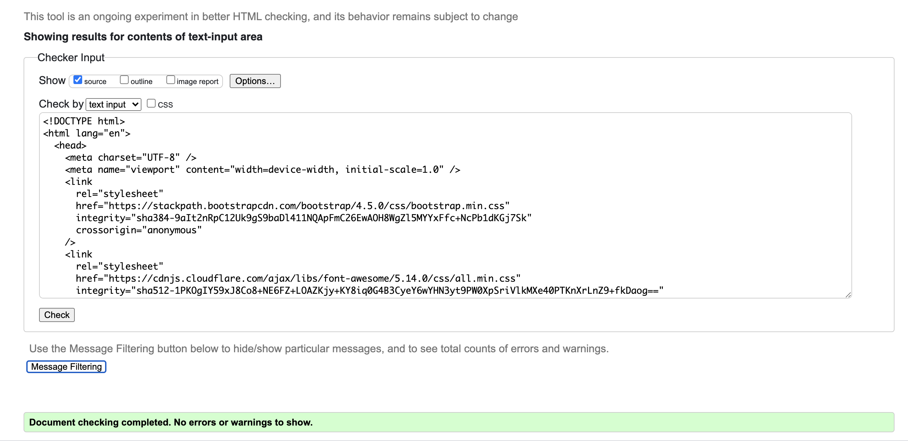
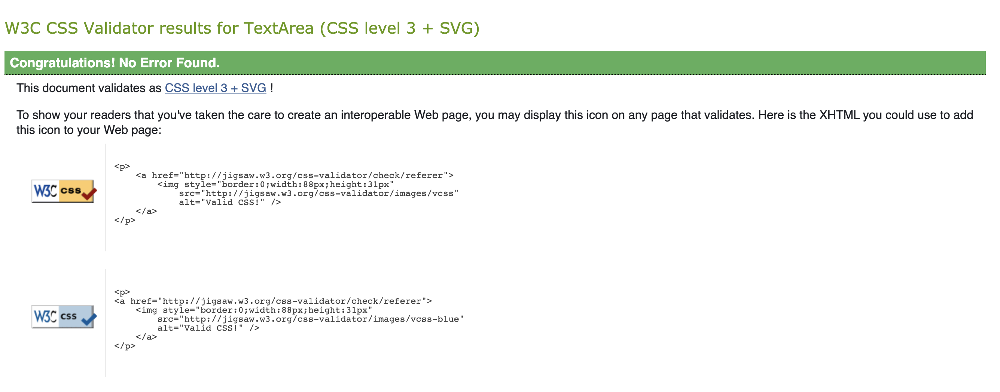
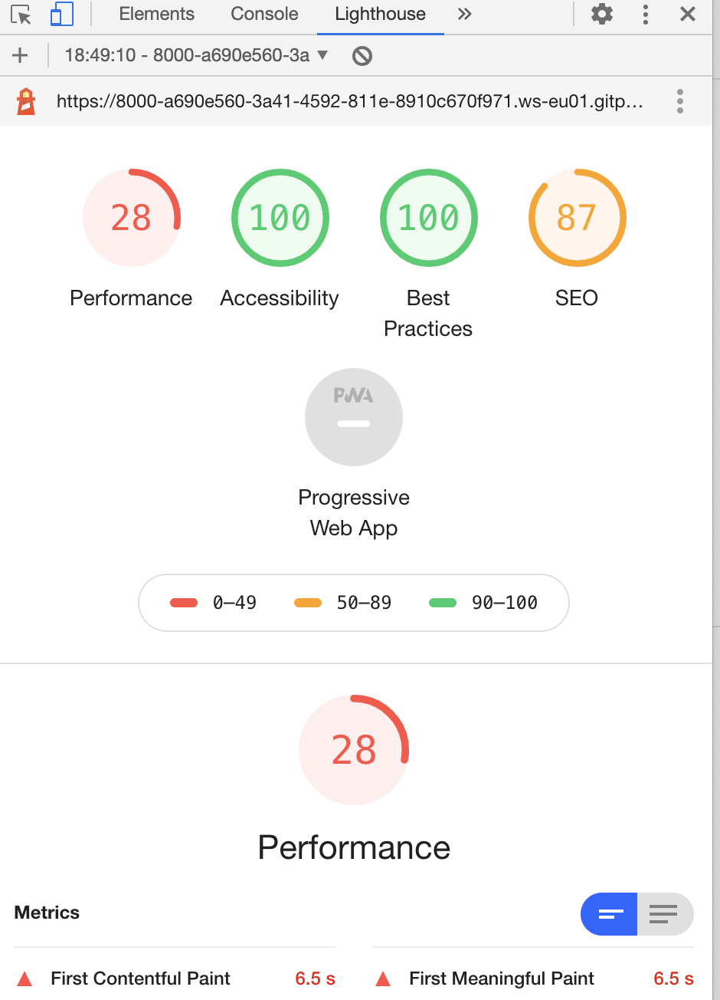
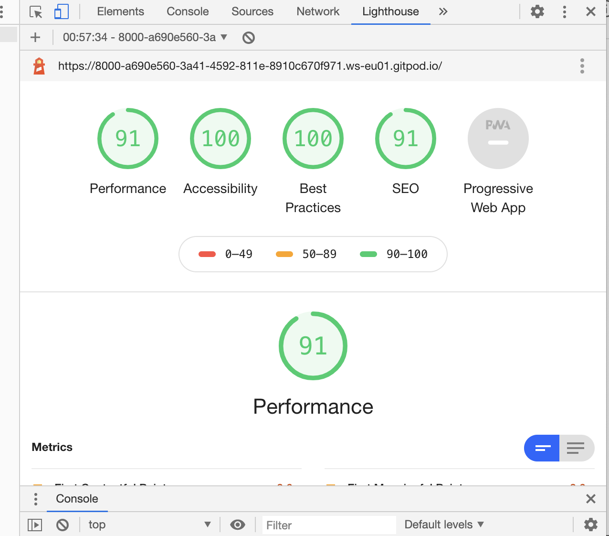

# Testing for |The Yoga Mat

## Validating Codes
The codes for this project were validated by using:
1. [W3C Markup Valitation](https://validator.w3.org)- to validate HTML code

- Here is a screenshot of one of the pages validated and no erros or warnings were found.
2. [W3C CSS Validation](https://jigsaw.w3.org/css-validator/)- to validate CSS code

- Here shows the css code validated and no erros found.

## Testing User Stories
1. Testing the **contact us** form;
  Being able to send a message with ease.
- Visit the **Contact** page
- Write Name, Email address and message where required.
- Click **Send Message** button
- Otherwise attempt sending message without filling one of the required fields
- It requires that the Email and message boxes be filled it will show a warning message if not.
- The message will not send if the email does not contain the **@** symbol

2. Information portrayed
- Being able to identify and understand where the sessions are located.
- The ability to have a quick preview of what to expect from the sessions. This can be screen
in the videos, **On The Mat** page.

## Cross Browser Testing
1. Chrome
* On the Chrome browser, the website loads at a reasonable rate, the photos take longer to load,
however once its loaded more than once it loads faster everytime.

This snippet shows lighthouse recomendations before being met.

Here is a spippet of the end result, as the recommendations were followed. Such as
to change the format of the images from png to jpg, make the text clearer for the viwer,
and add missing properties to certain codes.
2. Safari
* The website loads very quicly on the Safari browser
* The circular image appears differntly to when on the Chrome browser
* The videos won't play on the safari browser
* an additional video <source> was added with the webm format- this did not make the video play.
3. Firefox 
* The page loads faster on the Firefox browser than on Chrome or Safari
* The contact page, on Firefox acts slightly different than on safari or Chrome, 
the required boxes, turn read when empty.

## Testing on desktop 
- On mobile phones, the circular image takes longer to appear
- The images are as clear on the mobile phone as they are on a desktop
- The circular picture, is more centered when shown on Safari, when on Chrome it goes over the footer.
This has now been fixed, when a row property on css file was deleted.

## Testing on mobile phones
- The videos found o **On The Mat** page won't play on the iphone11.

## Bugs

### Unsolved Bugs
* The videos found o **On The Mat** page won't play on the safari browser.
* The margin-bottom cannot be applied on the containers to separate them from the footer, as the attribute
 **remove-vh** was added to stop content overflowing to the footer, because of the backgrownd image has a vh height value.

## Overall
* The website is readable on both big and small devices, on big screens like computers, the writing is visible as well as the pictures.
On small devices everything is also very clear, the one issue it contains when switching from small to bigger screens and vice versa
are the photos. the photo placed on the circular container changes sizes when on a smaller screen however, at a cost of the whole image itself.
* The **Contact Us** page is straight forward, and it works well.
